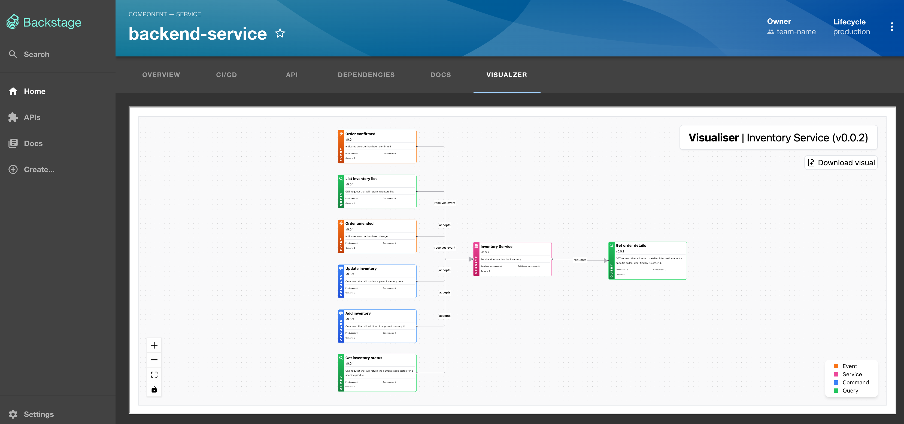
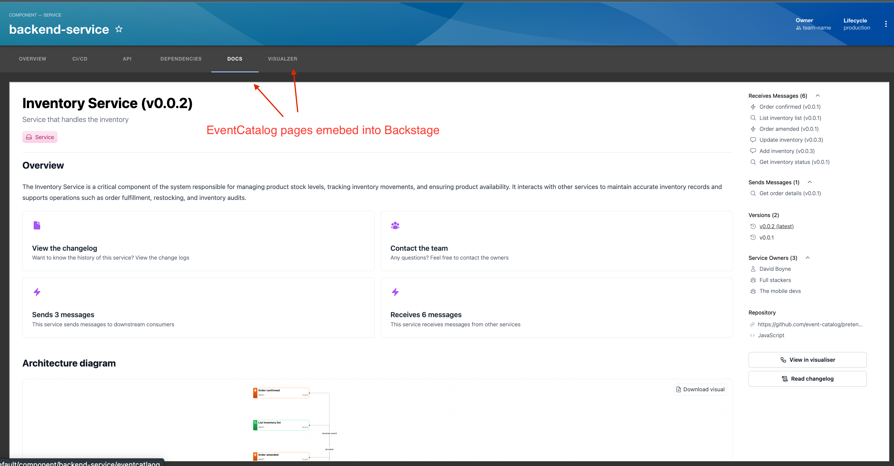
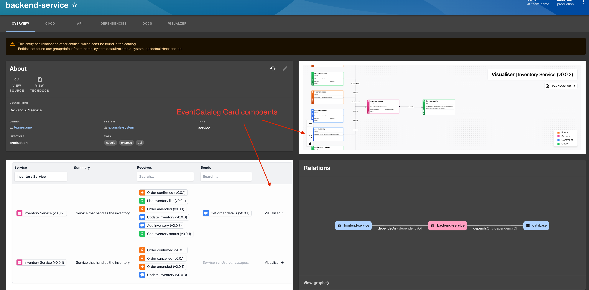

<div align="center">

<h1>⚡️ EventCatalog plugin for Backstage</h1>
<p>Embed your EventCatalog directly into Backstage. Document and visualize your event-driven architecture in Backstage.</p>

[![PRs Welcome][prs-badge]][prs]

[](https://discord.gg/3rjaZMmrAm) [](https://www.linkedin.com/in/david-boyne/) [](https://github.com/event-catalog/generator-openapi/blob/main/LICENSE.md)



<h4>Features: Embed EventCatalog into your Backstage project, including documentation, visualizer and table of messages. </h4>

[Read the Docs](https://www.eventcatalog.dev/docs/development/plugins/backstage/intro) | [View Demo](https://demo.eventcatalog.dev/docs)

</div>

<hr/>

# Core Features

- 📃 Bring [EventCatalog documentation](https://demo.eventcatalog.dev/docs/domains/Orders/0.0.3) into Backstage
- 📊 Embed [EventCatalog visualizer](https://demo.eventcatalog.dev/visualiser/domains/Orders/0.0.3) into your Backstage pages
- 🔎 Embed the [EventCatalog discovery table](https://demo.eventcatalog.dev/discover/events) to quickly find messages for your services
- ⭐ And much more...

# How it works

Many folks are using [Backstage](https://backstage.spotify.com/) for their internal developer portals. Backstage is a highly configurable platform that allows you to document your architecture in components, apis, services, domains and much more.

Backstage supports plugins, that have a frontend and backend support.

This EventCatalog plugin let's you embed your EventCatalog information inside your backstage instance.

This plugin exposes React components that you can embed on your pages to display information from EventCatalog

- `<EventCatalogDocumentationEntityPage page="docs/page/visualiser"  />`
  - Used to embed whole pages of EventCatalog into your Backstage instance. You can add these as tabs to your pages, clicking on the tab will show the desired feature.
  - You can also pass custom props to the component to override the id, collection and version (e.g `<EventCatalogDocumentationEntityPage page="docs/page/visualiser" id="my-id" collection="services" version="0.0.1" />`)
- `<EventCatalogEntityVisualiserCard />`
  - Used to embed a widget (Card) on your existing pages. This component will display the visualiser on your page.
- `<EventCatalogEntityMessageCard />`
  - Used to embed a widget (Card) on your existing pages. This component will display the explore (table) on your page. Great for displaying a list of messages your service produces/consumes.
- `<EventCatalogEntityEntityMapCard />`
  - Used to embed a widget (Card) on your existing pages. This component will display the entity map on your page. Great for displaying a list of entities for a given domain.

## Getting started

### 1. Install the plugin

```bash
yarn add @eventcatalog/backstage-plugin-eventcatalog
```

### 2. Add the EventCatalog URL to the app-config.yaml

The EventCatalog plugin needs to know the URL of your EventCatalog instance. This can be set in the `app-config.yaml` file.

```yaml
eventcatalog:
  URL: "https://demo.eventcatalog.dev"
```

### 3. Mapping Backstage resources to EventCatalog resources with annotations

Backstage and EventCatalog have different ways to create resources. For example backstage supports components, APIS, domains, systems etc, and EventCatalog supports resources (domains, services and messages (queries, commands and events)).

When you configure the plugin you need to map Backstage information to EventCatalog information, so the plugin knows which EventCatalog page to render.

We do this by adding annotations to the Backstage resources.

<!-- Make table -->

| Annotation | Required | Default | Description |
|------------|----------|---------|-------------|
| `eventcatalog.dev/id` | Yes | - | The id of the resource in EventCatalog |
| `eventcatalog.dev/version` | No | `latest` | The version of the resource in EventCatalog |
| `eventcatalog.dev/collection` | No | Uses the entity kind | The collection of the resource in EventCatalog. Options include `services`, `domains`, `queries`, `commands`, `events` |

Example of creating a new service in Backstage and mapping it to an EventCatalog resource:

```yaml
apiVersion: backstage.io/v1alpha1
kind: Component
metadata:
  name: backend-service
  description: Backend API service
  annotations:
    github.com/project-slug: organization/backend-repo
    # Here we map the Backstage service to an EventCatalog resource
    # The id of the resource in EventCatalog
    eventcatalog.dev/id: InventoryService
    # The version of the resource in EventCatalog
    eventcatalog.dev/version: 0.0.2
    # The collection of the resource in EventCatalog
    eventcatalog.dev/collection: services
  tags:
    - nodejs
    - express
    - api
spec:
  type: service
  lifecycle: production
  owner: team-name
  system: example-system
  providesApis:
    - backend-api
  dependsOn:
    - resource:default/database
```

### 4. Using the components

_Assumes a new Backstage installation, install guides my vary_.

#### Tabbed pages

```js
import { EventCatalogDocumentationEntityPage } from "@eventcatalog/backstage-plugin-eventcatalog";
```

The `EventCatalogDocumentationEntityPage` components, is a full page component that you can assign to any `EntityLayout.Route`. Example:



```js
// Will create a new tab called "Docs" and route called /eventcatalog. This will embed the docs for that
// entity in your page. Using the info from the app-config to map your Backstage ID to EventCatalog ID
<EntityLayout.Route path="/eventcatlaog" title="Docs">
  <EventCatalogDocumentationEntityPage page='docs' />
</EntityLayout.Route>

// Will create a new tab called "Visualzer" and route called /eventcatalog-visualizer.
// This will embed the EventCatalog visualiser to your Backstage entity
<EntityLayout.Route path="/eventcatlaog-visualizer" title="Visualzer">
  <EventCatalogDocumentationEntityPage page='visualiser' />
</EntityLayout.Route>

// Will create a new tab called "Entity Map" and route called /eventcatalog-entity-map.
// This will embed the EventCatalog entity map to your Backstage entity
<EntityLayout.Route path="/eventcatlaog-entity-map" title="Entity Map">
  <EventCatalogDocumentationEntityPage page='entity-map' />
</EntityLayout.Route>

// Override the id, collection and version of the resource in EventCatalog
// you can choose to override what is rendered, (not read from your backstage configuration)
<EntityLayout.Route path="/eventcatlaog-entity-map" title="Entity Map">
  <EventCatalogDocumentationEntityPage page='entity-map' id="MyDomainId" collection="domains" version="0.0.1" />
</EntityLayout.Route>

```

#### Card components

These components can be added to your pages as Cards, that can live inside the Backstage Grid System.



```js
import {
  EventCatalogEntityVisualiserCard,
  EventCatalogEntityMessageCard,
  EventCatalogEntityEntityMapCard,
} from "@eventcatalog/backstage-plugin-eventcatalog";

<Grid container spacing={3} alignItems="stretch">
  <Grid item md={6}>
    <!-- Backstage card -->
    <EntityAboutCard variant="gridItem" />
  </Grid>
  <Grid item md={6}>
    <!-- Adds the visualizer to a grid item in Backstage -->
    <EventCatalogEntityVisualiserCard />
  </Grid>
  <Grid item md={6} xs={12}>
    <!-- Adds the explore (messages) to a grid item in Backstage -->
    <EventCatalogEntityMessageCard />
  </Grid>
  <Grid item md={6} xs={12}>
    <!-- Adds the entity map to a grid item in Backstage -->
    <EventCatalogEntityEntityMapCard />
  </Grid>
</Grid>;
```

---

## Found a problem?

Raise a GitHub issue on this project, or contact us on [our Discord server](https://discord.gg/3rjaZMmrAm).

# Sponsors

Thank you to our project sponsors.

## Gold sponsors

<div align="center">
  
  <p style="margin: 0; padding: 0;">Serverless infrastructure for event-driven architecture. </p>
  <a href="https://hookdeck.com/?ref=eventcatalog-sponsor" target="_blank" >Learn more</a>
</div>

<hr />

<div align="center">
  
  <p style="margin: 0; padding: 0;">Manage, secure, and govern every API in your organization</p>
  <a href="https://gravitee.io?utm_source=eventcatalog&utm_medium=web&utm_campaign=sponsorship" target="_blank" >Learn more</a>
</div>

<hr />

_Sponsors help make EventCatalog sustainable, want to help the project? Get in touch! Or [visit our sponsor page](https://www.eventcatalog.dev/support)._

# Enterprise support

Interested in collaborating with us? Our offerings include dedicated support, priority assistance, feature development, custom integrations, and more.

Find more details on our [services page](https://eventcatalog.dev/services).

# Contributing

If you have any questions, features or issues please raise any issue or pull requests you like. We will try my best to get back to you.

You can find the [contributing guidelines here](https://eventcatalog.dev/docs/contributing/overview).

## Running the project locally

1. Clone the repo
1. Install required dependencies `yarn install`

[license-badge]: https://img.shields.io/github/license/event-catalog/backstage-plugin-eventcatalog.svg?color=yellow
[license]: https://github.com/event-catalog/backstage-plugin-eventcatalog/blob/main/LICENSE
[prs-badge]: https://img.shields.io/badge/PRs-welcome-brightgreen.svg?style=flat-square
[prs]: http://makeapullrequest.com
[github-watch-badge]: https://img.shields.io/github/watchers/event-catalog/backstage-plugin-eventcatalog.svg?style=social
[github-watch]: https://github.com/event-catalog/backstage-plugin-eventcatalog/watchers
[github-star-badge]: https://img.shields.io/github/stars/event-catalog/backstage-plugin-eventcatalog.svg?style=social
[github-star]: https://github.com/event-catalog/backstage-plugin-eventcatalog/stargazers

# Commercial Use

This project is governed by a [dual-license](./LICENSE.md). To ensure the sustainability of the project, you can freely make use of this software if your projects are Open Source. Otherwise for internal systems you must obtain a [commercial license](./LICENSE-COMMERCIAL.md).

If you would like to obtain a Commercial License, you can purchase a license at https://dashboard.eventcatalog.dev or email us at `hello@eventcatalog.dev`
