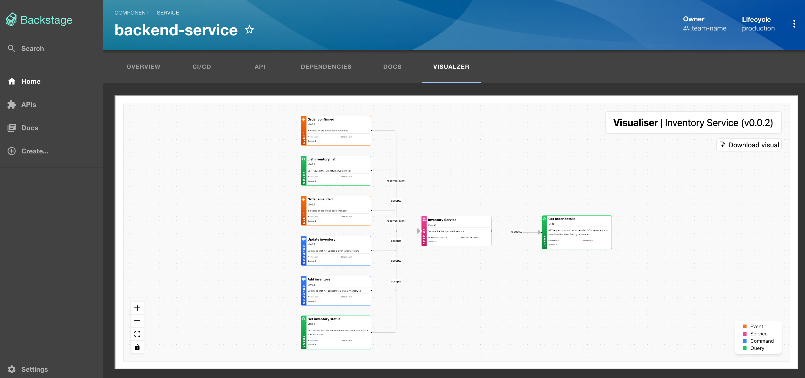

<div align="center">

<h1>⚡️ EventCatalog plugin for Backstage</h1>
<p>Embed EventCatalog documentation and architecture visualizations in Backstage.</p>

[![PRs Welcome][prs-badge]][prs]

[](https://discord.gg/3rjaZMmrAm)
[](./LICENSE.md)



[Documentation](https://www.eventcatalog.dev/docs/plugins/backstage/overview) | [Explore the EventCatalog demo](https://demo.eventcatalog.dev)

</div>

## Features

Use EventCatalog as a frontend integration inside Backstage entity pages. The plugin can embed:

- resource documentation and visualizers
- discovery tables for services and messages
- entity maps and the schema explorer
- the catalog-wide Architecture Graph, optionally focused on an entity with a relationship depth
- the System Context Map overview or the context map for a specific system
- flow visualizers

Every page and card component supports `theme="light"` and `theme="dark"`. The embedded view uses the visitor's saved EventCatalog theme when this prop is omitted.

## Get started

You will need a Backstage app, an EventCatalog instance that the user's browser can reach, and an EventCatalog Scale license for commercial use.

### 1. Enable the integration in EventCatalog

Add your Scale license key to the `.env` file in the EventCatalog project:

```bash
EVENTCATALOG_SCALE_LICENSE_KEY=your-scale-license-key
```

Build and deploy EventCatalog with this environment variable. Existing Backstage-specific keys can continue to use `EVENTCATALOG_LICENSE_KEY_BACKSTAGE`, but new deployments should use `EVENTCATALOG_SCALE_LICENSE_KEY`.

See [Getting a license key for integrations](https://www.eventcatalog.dev/docs/development/license-keys/integrations).

### 2. Install the plugin

From the root of your Backstage app:

```bash
yarn add @eventcatalog/backstage-plugin-eventcatalog
```

### 3. Configure the EventCatalog URL

Add the public base URL of your EventCatalog instance to `app-config.yaml`:

```yaml
eventcatalog:
  URL: https://demo.eventcatalog.dev
```

Use the base URL only. Do not add a view path such as `/docs` or `/visualiser`; the plugin builds the embed URL for each component.

### 4. Map a Backstage entity

Add EventCatalog annotations to the Backstage catalog entity:

```yaml
apiVersion: backstage.io/v1alpha1
kind: Component
metadata:
  name: order-service
  description: Handles customer orders
  annotations:
    eventcatalog.dev/id: order-service
    eventcatalog.dev/version: 1.0.0
    eventcatalog.dev/collection: services
spec:
  type: service
  lifecycle: production
  owner: team-orders
```

| Annotation | Required | Description |
| --- | --- | --- |
| `eventcatalog.dev/id` | Usually | EventCatalog resource ID. The catalog-wide System Context Map overview does not require one. |
| `eventcatalog.dev/version` | Depends on the view | EventCatalog resource version. Entity maps, flows, and system-specific context maps require a version. |
| `eventcatalog.dev/collection` | Sometimes | EventCatalog collection, such as `services`, `domains`, `events`, `commands`, or `queries`. |

The plugin infers `services` for Backstage service components and APIs, and `domains` for Backstage domains. Other entity kinds should provide `eventcatalog.dev/collection` or an explicit `collection`/`type` prop.

Annotations are used by default. Components that expose selection props can override them with `id`, `version`, `collection`, `type`, `system`, or `flow`.

### 5. Add an entity tab

Import the general-purpose page component and add it to an `EntityLayout`:

```tsx
import { EventCatalogDocumentationEntityPage } from '@eventcatalog/backstage-plugin-eventcatalog';

<EntityLayout.Route path="/eventcatalog-docs" title="EventCatalog: Docs">
  <EventCatalogDocumentationEntityPage page="docs" />
</EntityLayout.Route>
```

Open a mapped entity and select **EventCatalog: Docs**. If a mapping message appears, check the annotations and make sure Backstage has re-ingested the entity.

## Add entity tabs

The general-purpose component supports these `page` values:

| Value | Embedded view | Selection requirements |
| --- | --- | --- |
| `docs` | Resource documentation | Mapped resource or explicit overrides |
| `visualiser` | Resource visualizer | Mapped resource or explicit overrides |
| `discover` | Discovery table for the mapped collection | Mapped resource |
| `entity-map` | Resource entity map | ID, collection, and version |
| `schema-explorer` | Catalog schema explorer | Global view rendered from a mapped entity page |
| `architecture-graph` | Architecture Graph | Prefer the dedicated component below |
| `system-context-map` | System Context Map | Prefer the dedicated component below |
| `flow` | Flow visualizer | Prefer the dedicated component below |

For example:

```tsx
<EntityLayout.Route path="/eventcatalog-visualizer" title="EventCatalog: Visualizer">
  <EventCatalogDocumentationEntityPage page="visualiser" />
</EntityLayout.Route>

<EntityLayout.Route path="/eventcatalog-messages" title="EventCatalog: Messages">
  <EventCatalogDocumentationEntityPage page="discover" />
</EntityLayout.Route>

<EntityLayout.Route path="/eventcatalog-entity-map" title="EventCatalog: Entity Map">
  <EventCatalogDocumentationEntityPage page="entity-map" />
</EntityLayout.Route>

<EntityLayout.Route path="/eventcatalog-schema-explorer" title="EventCatalog: Schema Explorer">
  <EventCatalogDocumentationEntityPage page="schema-explorer" />
</EntityLayout.Route>
```

Use the dedicated components for the Architecture Graph, System Context Map, and flows:

```tsx
import {
  EventCatalogArchitectureGraphEntityPage,
  EventCatalogFlowEntityPage,
  EventCatalogSystemContextMapEntityPage,
} from '@eventcatalog/backstage-plugin-eventcatalog';

<EntityLayout.Route path="/eventcatalog-architecture" title="EventCatalog: Architecture">
  <EventCatalogArchitectureGraphEntityPage type="service" depth={2} />
</EntityLayout.Route>

{/* Omit system and version to show the catalog-wide overview. */}
<EntityLayout.Route path="/eventcatalog-system-context" title="EventCatalog: System Context">
  <EventCatalogSystemContextMapEntityPage />
</EntityLayout.Route>

<EntityLayout.Route path="/eventcatalog-order-system" title="EventCatalog: Order System">
  <EventCatalogSystemContextMapEntityPage
    system="order-management-system"
    version="1.0.0"
  />
</EntityLayout.Route>

<EntityLayout.Route path="/eventcatalog-checkout-flow" title="EventCatalog: Checkout Flow">
  <EventCatalogFlowEntityPage flow="checkout-saga" version="1.0.0" />
</EntityLayout.Route>
```

Architecture Graph depth can be `1`, `2`, or `3` and defaults to `2`. The graph uses the latest version of each resource, so the `version` prop does not change its graph data.

## Add overview cards

Card components render the same EventCatalog views inside a Backstage grid:

| Component | View |
| --- | --- |
| `EventCatalogEntityVisualiserCard` | Resource visualizer |
| `EventCatalogEntityMessageCard` | Discovery table |
| `EventCatalogEntityEntityMapCard` | Entity map |
| `EventCatalogEntitySchemaExplorerCard` | Schema explorer |
| `EventCatalogEntityArchitectureGraphCard` | Architecture Graph |
| `EventCatalogEntitySystemContextMapCard` | System Context Map |
| `EventCatalogEntityFlowCard` | Flow visualizer |

The cards use `height: 100%`, so give each parent grid item a concrete height:

```tsx
import {
  EventCatalogEntityArchitectureGraphCard,
  EventCatalogEntityFlowCard,
  EventCatalogEntitySchemaExplorerCard,
} from '@eventcatalog/backstage-plugin-eventcatalog';

<Grid container spacing={3} alignItems="stretch">
  <Grid item xs={12} style={{ height: 'calc(100vh - 240px)', minHeight: 600 }}>
    <EventCatalogEntityArchitectureGraphCard
      type="service"
      depth={2}
      theme="dark"
    />
  </Grid>

  <Grid item md={6} xs={12} style={{ height: 700 }}>
    <EventCatalogEntitySchemaExplorerCard theme="dark" />
  </Grid>

  <Grid item md={6} xs={12} style={{ height: 700 }}>
    <EventCatalogEntityFlowCard
      flow="checkout-saga"
      version="1.0.0"
      theme="dark"
    />
  </Grid>
</Grid>
```

Avoid percentage heights unless every ancestor has a defined height. Full-page components fill the height supplied by `EntityLayout.Route`; give any custom route wrapper an explicit height if it collapses.

## Component props

The general-purpose and dedicated components expose these selection and display props where applicable:

| Prop | Type | Description |
| --- | --- | --- |
| `id` | `string` | Override the EventCatalog resource ID. It also aliases `system` and `flow` on their dedicated components. |
| `version` | `string` | Override the EventCatalog resource version. |
| `collection` | `string` | Override the EventCatalog collection. |
| `type` | `string` | Alias for `collection`; known singular types are converted to plural collections. |
| `theme` | `'light' \| 'dark'` | Force the theme for this embed. |
| `depth` | `1 \| 2 \| 3` | Set the Architecture Graph relationship depth. |
| `system` | `string` | Select a system for a system-specific context map. |
| `flow` | `string` | Select a flow. A version is also required. |

For the complete API and task-oriented examples, read the [Backstage plugin documentation](https://www.eventcatalog.dev/docs/plugins/backstage/overview).

## Contributing and support

Read the [contributing guidelines](https://www.eventcatalog.dev/docs/contributing/overview), [raise a GitHub issue](https://github.com/event-catalog/backstage-plugin-eventcatalog/issues), or contact the community on [Discord](https://discord.gg/3rjaZMmrAm).

For enterprise support, priority assistance, feature development, and custom integrations, see [EventCatalog services](https://www.eventcatalog.dev/services).

To run the project locally:

1. Clone the repository.
2. Run `yarn install`.
3. Run `yarn start`.

## License

This project uses a [dual-license model](./LICENSE.md): AGPL-3.0 for qualifying open-source use and a [commercial license](./LICENSE-COMMERCIAL.md) for proprietary or internal use. Contact `hello@eventcatalog.dev` with licensing questions.

[prs-badge]: https://img.shields.io/badge/PRs-welcome-brightgreen.svg?style=flat-square
[prs]: http://makeapullrequest.com
